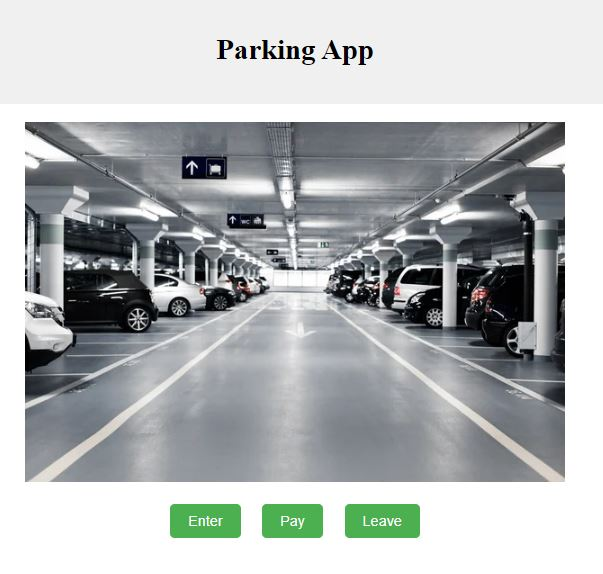
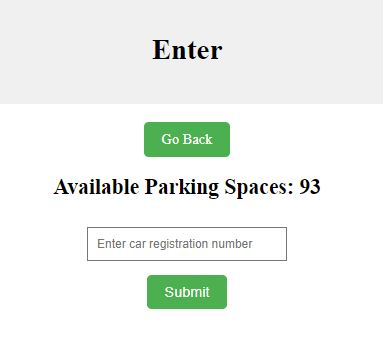
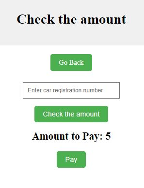
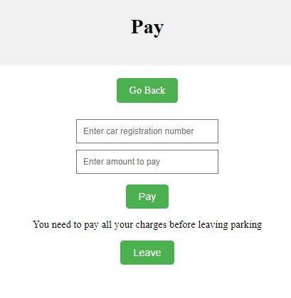
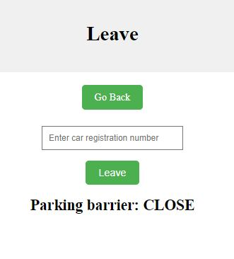

<p></p>

============
## Description
Parking app

Available pages and actions:
- enter the parking
- check the bill
- pay the due
- leave the parking

<p></p>
<p></p>
<p></p>
<p></p>

Flexible configuration:
* Total parking space
* Free time (how long car can spend inside parking without payment)
* Price for first hour
* Price for following hours

Technology:
* BackEnd: Python (3.11)
* FrontEnd: Flask (3.0.3)
* DataBase: PostgreSQL

## Installation

```bash
pip install -r requirements.txt
```

To configure DataBase, use below command in SQL Shell (psql)

```doctest
CREATE TABLE parking_data (
id SERIAL PRIMARY KEY,
carNumber varchar(20),
moneyPaid decimal,
moneyDue decimal,
canGo boolean,
enterTime timestamp,
parkingTime integer);

\dt+ = show list of tables
```

You can manage your DataBase by using the pgAdmin app f.e.

# Usage

# FAQ

# Support

# Contributing
- Source Code: [GitHub](https://github.com/Kika-hash/parking_public)

# Contact information

# License
Public domain

# Acknowledgment